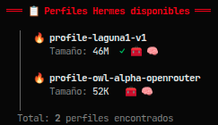

# 🔥 ignisky-forge — La forja de tus perfiles Hermes

[](https://github.com/yosoyignicion/ignisky-forge)
[](LICENSE)
[](.github/workflows/lint.yml)
[](https://hermes-agent.nousresearch.com)
[](https://github.com/yosoyignicion)
[](https://ignaciodev.gumroad.com/l/ignisky-forge)

> **ignisky-forge** es la herramienta definitiva para gestionar, clonar, fusionar y sincronizar perfiles de **Hermes Agent**. Como una forja para herreros digitales, moldea y mantiene tus perfiles con precisión artesanal.

---

## 📸 Capturas

<p align="center">
  
  <br>
  <sub>Lista de perfiles Hermes disponibles 🔥</sub>
</p>

---

## 📦 Instalación

```bash
# 1. Clona o descarga el repositorio
git clone https://github.com/yosoyignicion/ignisky-forge.git
cd ignisky-forge

# 2. Hazlo ejecutable
chmod +x ignisky-forge.sh

# 3. (Opcional) Instala en tu PATH
sudo make install
```

**Requisitos:**
- [Hermes Agent](https://hermes-agent.nousresearch.com) instalado
- Bash 4+ (viene en cualquier Linux/macOS moderno)
- Perfiles de Hermes en `~/.hermes/profiles/`

---

## 🚀 Uso rápido

```bash
# Modo interactivo (menú con opciones 1-8)
./ignisky-forge.sh

# Listar perfiles disponibles
./ignisky-forge.sh --list

# Clonar un perfil
./ignisky-forge.sh --clone profile-origen profile-destino

# Comparar dos perfiles
./ignisky-forge.sh --diff profile-a profile-b

# Backup de un perfil
./ignisky-forge.sh --backup profile-laguna1-v1
```

---

## 🆓 Funciones Gratis

| Comando | Descripción |
|---------|-------------|
| `--list` | Lista todos los perfiles Hermes disponibles con tamaño y componentes |
| `--clone <origen> <dest>` | Clona estructura completa de directorios entre perfiles |
| `--diff <a> <b>` | Compara config.yaml, skills, SOUL.md y memorias entre dos perfiles |
| `--backup <perfil>` | Crea backup del perfil en `~/.hermes/backups/forge/` (máx. 5 por perfil) |
| `--help` | Muestra la ayuda completa del script |

---

## 💎 Funciones Premium

| Comando | Feature | Descripción |
|---------|---------|-------------|
| `--merge <a> <b>` | `forge:fuse` | Smart Merge que fusiona config.yaml de 2 perfiles conservando settings de ambos |
| `--sync <from> <to>` | `forge:sync` | Sincroniza skills de un perfil a otro resolviendo conflictos |
| `--migrate-engram <f> <t>` | `forge:migrate` | Migra memorias (SQLite/FTS5) entre perfiles |
| `--schedule <perfil>` | `forge:scheduler` | Programa backups automáticos con cron |
| `--snapshot` | `forge:snap` | Crea restore point con timestamp de todo el estado |

```bash
# Las funciones premium muestran información del pack con cupón de descuento:
./ignisky-forge.sh --merge perfil-a perfil-b
./ignisky-forge.sh --sync desde hacia
./ignisky-forge.sh --snapshot
```

> 🏷️ **Cupón exclusivo:** `IGNICION25` — 25% OFF en el pack premium

---

## 🎮 Modo Interactivo

Ejecuta el script sin argumentos para entrar en el menú:

```
┌─ ¿Qué quieres hacer en la forja? ─────────────────────┐
│  1  📋  Listar perfiles disponibles
│  2  🔄  Clonar un perfil
│  3  🔍  Comparar dos perfiles (diff)
│  4  💾  Hacer backup de un perfil
│  5  🧬  Fusionar configs (Premium)
│  6  📤  Sincronizar skills (Premium)
│  7  🧠  Migrar memorias (Premium)
│  8  💎  Ver funciones premium
│  0  🚪  Salir
└────────────────────────────────────────────────────────┘
```

---

## 📂 Estructura del proyecto

```
ignisky-forge/
├── ignisky-forge.sh          # Script principal
├── README.md                 # Esta documentación
├── LICENSE                   # MIT License
├── Makefile                  # Instalación y utilidades
├── .gitignore                # Archivos ignorados
└── .github/
    └── workflows/
        └── lint.yml          # CI: ShellCheck
```

---

## 🔗 Enlaces internos

| Script | Descripción |
|--------|-------------|
| [ignisky-kindler](https://github.com/yosoyignicion/ignisky-kindler) | El encendedor de tu ecosistema MCP 🔥 |
| [ignisky-forge](https://github.com/yosoyignicion/ignisky-forge) | **← Estás aquí — La forja de perfiles Hermes** |
| [ignisky-mirror](https://github.com/yosoyignicion/ignisky-mirror) | Espejo y respaldo de configs |
| [ignisky-lens](https://github.com/yosoyignicion/ignisky-lens) | Visor y depurador de configuración |

---

## 🛠️ Desarrollo

```bash
# Analizar el script con shellcheck
make audit

# Instalar en el sistema
sudo make install

# Desinstalar
sudo make uninstall

# Limpiar archivos temporales
make clean
```

---

## 🤖 Prompt para Hermes Agent

Si usas Hermes Agent, copia y pega esto en el chat para que lo instale por ti:

```text
/background bash -c "
  git clone https://github.com/yosoyignicion/ignisky-forge.git ~/ignisky-forge &&
  cd ~/ignisky-forge &&
  chmod +x ignisky-forge.sh &&
  sudo make install
"

# Una vez instalado, ejecuta:
ignisky-forge --list
ignisky-forge --health
```

> **💎 ¿Tienes la versión premium de Gumroad?** Sustituye el script descargado del ZIP
> por el que viene en el pack (`ignisky-forge.sh`) y repite la instalación.
> Las funciones premium se desbloquean automáticamente.

---

## 📜 Licencia

MIT © 2026 — **IgnicionDev** (yosoyignicion)

---

<p align="center">
  <strong>🔥 ignisky-* · El ecosistema Ignición para Hermes Agent</strong><br>
  <sub>Creado por <a href="https://github.com/yosoyignicion">IgnicionDev</a> · 
  <a href="https://ignaciodev.gumroad.com/l/ignisky-forge">Pack Premium</a> · 
  Cupón: <code>IGNICION25</code></sub>
</p>

<p align="center">
  <a href="https://discord.gg/..."></a>
  <a href="https://github.com/yosoyignicion"></a>
</p>
